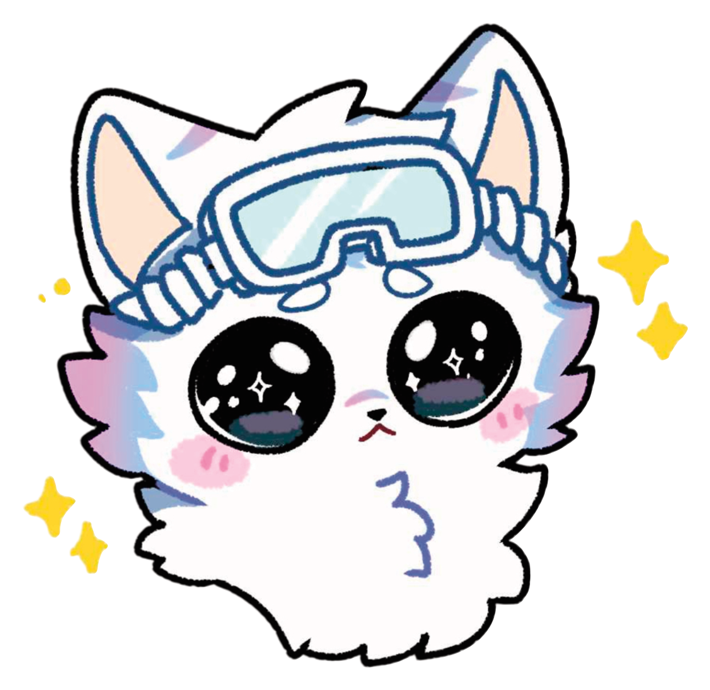
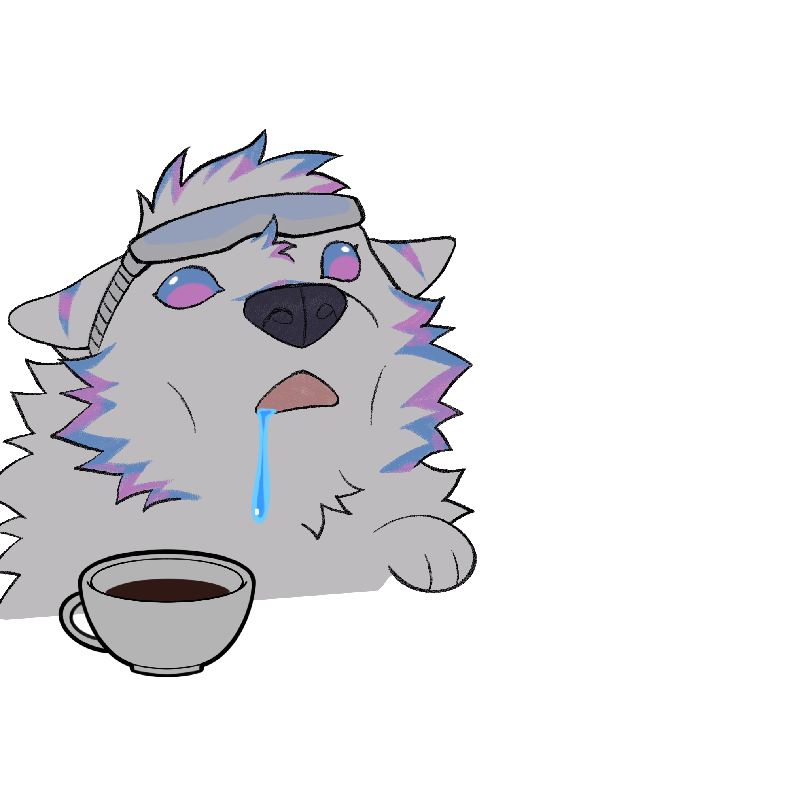

<!-- ===================== HEADER ===================== -->

  

<table>
  <tr>
    <td width="70%" valign="middle">

<h1>Hi 👋, I'm Cyrus</h1>

<h3>Unity Game Developer from Vietnam 🇻🇳</h3>

I build **gameplay systems, simulation mechanics and Unity tools** with C#.

Currently working on **Furever**, a cozy life simulation game built with Unity 6.

 

  </td>

  <td width="30%" align="center" valign="middle">
    
  </td>
  </tr>
</table>

 

<!-- ===================== CURRENT PROJECT ===================== -->

## 🐺 Currently Building

<table>
  <tr>
    <td width="28%" align="center" valign="middle">
      
    </td>

    <td width="72%" valign="middle">

### Furever

A cozy life simulation game built with **Unity 6**.

Currently developing systems for:

`Interaction System`
`Player States`
`Build Mode`
`Inventory`

`Day / Night`
`Fishing`
`Player Needs`
`Editor Tools`

I focus on creating reusable gameplay architecture instead of one-off mechanics.

  </td>
  </tr>
</table>

 

  

<!-- ===================== TECH ===================== -->

## 🛠️ Tech & Tools

  

  <b>Unity 6</b>
  • C#
  • URP
  • Input System
  • Cinemachine
  • ScriptableObjects
  • Git

 

<!-- ===================== ACTIVITY ===================== -->

## 📊 Development Activity

  

  

  

 

  

<!-- ===================== PACMAN ===================== -->

## 👾 Contributions

<picture>
  <source
    media="(prefers-color-scheme: dark)"
    srcset="https://raw.githubusercontent.com/ArciusWolf/ArciusWolf/pacman-output/pacman-contribution-graph-dark.svg?game=pacman"
  >
  <source
    media="(prefers-color-scheme: light)"
    srcset="https://raw.githubusercontent.com/ArciusWolf/ArciusWolf/pacman-output/pacman-contribution-graph.svg?game=pacman"
  >
  
</picture>

 

<!-- ===================== MUSIC ===================== -->

## 🎧 What I'm Listening To

<table>
  <tr>
    <td width="72%" valign="middle">

  </td>

  <td width="28%" align="center" valign="bottom">
    
  </td>
  </tr>
</table>

 

<!-- ===================== ABOUT ===================== -->

## About Me

I'm particularly interested in:

- 🎮 Gameplay systems
- 🧩 Game architecture
- 🛋️ Interaction systems
- 🏗️ Building & placement mechanics
- 🧍 Character state systems
- 🕐 Simulation and time systems
- 🛠️ Unity Editor tooling
- ⚡ Performance-conscious development

 

<!-- ===================== FOOTER ===================== -->

  

  Building systems, breaking systems, then rebuilding them better.

